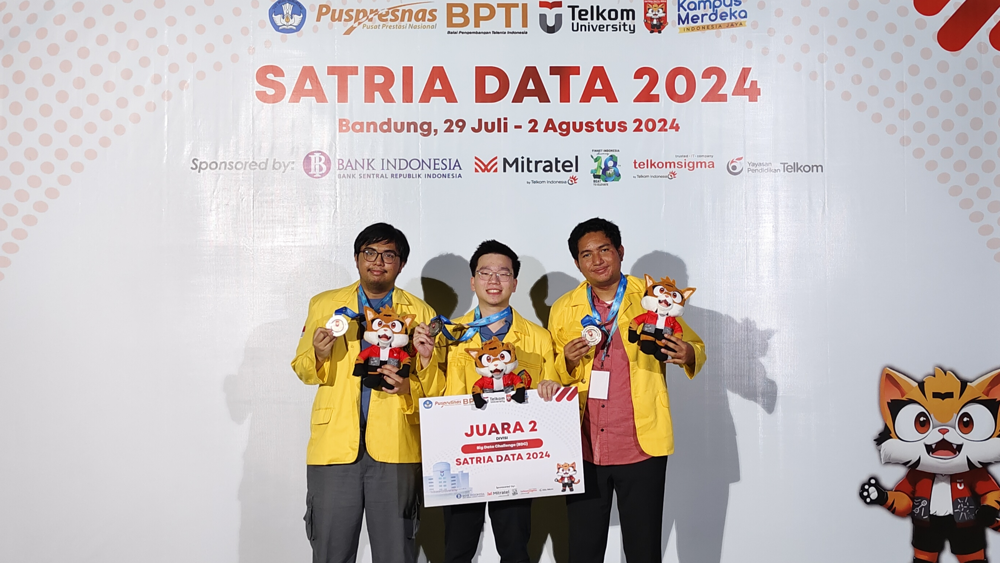

# Three Outliers

Competition work from **Three Outliers**, We are a data science team from Universitas Indonesia. This covers national data science competitions from 2023 to 2024.

<p align="center">
  
</p>

## Team

| Member | LinkedIn | GitHub |
|---|---|---|
| **Eduardus Tjitrahardja** | [edutjie](https://www.linkedin.com/in/edutjie/) | [@edutjie](https://github.com/edutjie) |
| **Ikhlasul Akmal Hanif** | [ikhlasul-akmal-h](https://www.linkedin.com/in/ikhlasul-akmal-h/) | [@IkhlasulHanif](https://github.com/IkhlasulHanif) |
| **Rahmat Bryan Naufal** | [rahmat-bryan-naufal](https://www.linkedin.com/in/rahmat-bryan-naufal/) | [@rahmat-bryan-naufal](https://github.com/rahmat-bryan-naufal) |

## Highlights

- 🥇 **1st place**, GEMASTIK XVII (2024), Data Mining final: private leaderboard
- 🥇 **1st place**, Dataquest by Airnology 2.0 (2023)
- 🥈 **2nd place**, Satria Data 2024, Big Data Challenge
- 🥈 **2nd place**, Intelligo ID Data Competition 2023

## Competitions

| Year | Competition | Task | Result | Folder |
|---|---|---|---|---|
| 2024 | GEMASTIK XVII, Data Mining | Multimodal (DINOv2 + E5) citizen-report routing paper; on-site UKT group classification with a GBDT hill-climbing ensemble | 🥇 1st (final private LB) | [`gemastik-xvii`](gemastik-xvii) |
| 2024 | Satria Data 2024, Big Data Challenge | Indonesian election tweet topic classification (IndoBERTweet, CatBoost, ensemble); lexical-mutation campaign analysis | 🥈 2nd place | [`satria-data-2024`](satria-data-2024) |
| 2023 | Dataquest by Airnology 2.0 | Rainfall regression for IKN; image-based drug search engine (OCR + Levenshtein spelling correction) | 🥇 1st place | [`dataquest-2023`](dataquest-2023) |
| 2023 | Intelligo ID Data Competition | Late-delivery prediction; low-cost Indonesian logistics sentiment analysis with pseudo-labelling | 🥈 2nd place | [`intelligo-2023`](intelligo-2023) |
| 2023 | GEMASTIK XVI, Data Mining | Helmet detection with Deformable DETR (paper); on-site web-attack log classification into MITRE ATT&CK tactics | Finalist | [`gemastik-xvi`](gemastik-xvi) |
| 2023 | Satria Data 2023, Big Data Challenge | Indonesian license plate recognition (Keras-OCR, TrOCR, Faster R-CNN) | — | [`satria-data-2023`](satria-data-2023) |
| 2023 | Data Science Weekend (DSW) 2023 | Telco churn prediction with active learning and LLM-driven retention advice | — | [`dsw-2023`](dsw-2023) |

## Repository layout

Each competition folder has its own README (problem, approach, results, how to run) and follows the same structure:

```
<competition>/
  README.md
  notebooks/     final solution notebooks
  experiments/   iterations and ablations
  preparation/   practice work before an on-site final (where applicable)
  docs/          our papers and slides
  data/          small data files and submissions only
  assets/        certificates, photos, figures
  references/    third-party material we studied (credited)
```

## Notes

- **Data and model weights are not included.** Full competition datasets, and every model checkpoint, have been left out. Each README says where to get the data and what layout the notebooks expect.
- The notebooks are the originals from the competitions. They were cleaned up for readability (clearer names, paths gathered into constants, noisy outputs trimmed), and the modelling logic is unchanged. Many were written for Colab or Kaggle, so the paths and installed packages may need adjusting before a local run.
- API keys are read from environment variables (`HF_TOKEN`, `OPENAI_API_KEY`, `WANDB_API_KEY`).
