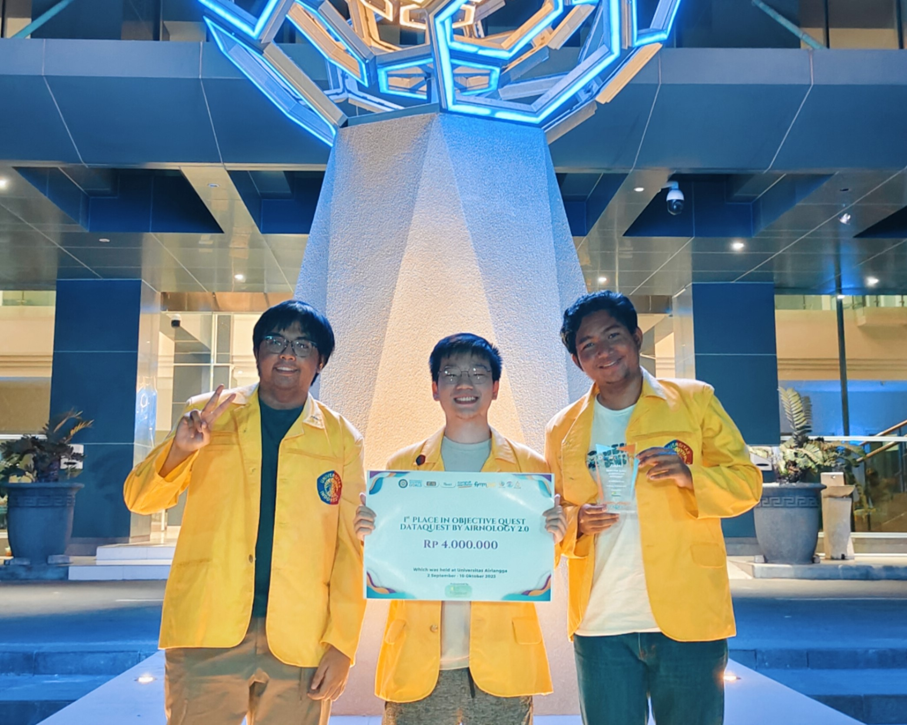
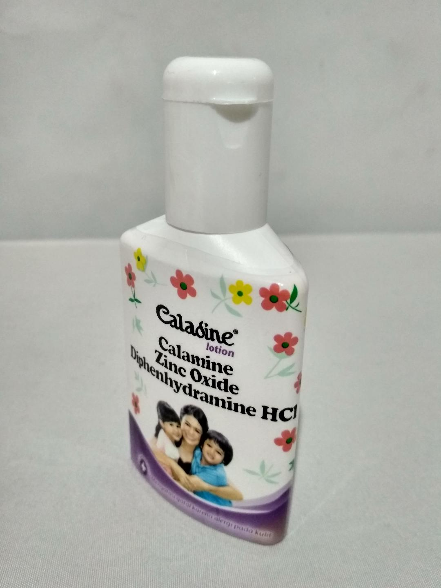
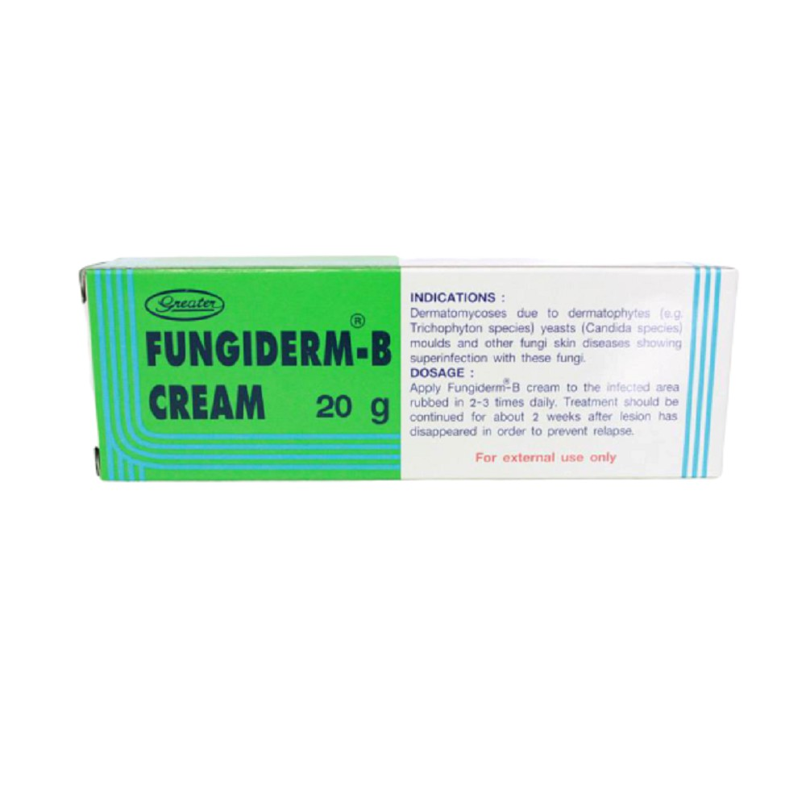
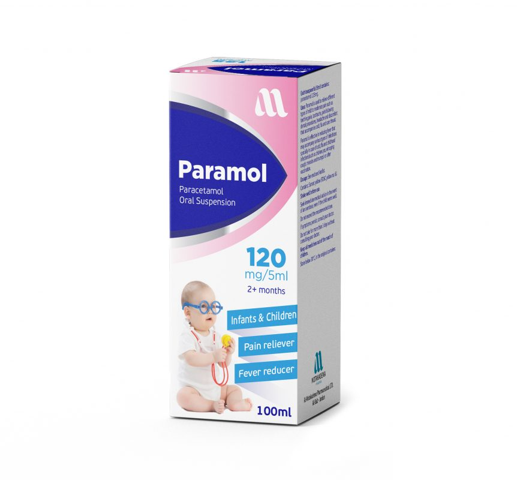

# Dataquest by Airnology 2.0 (2023): Rainfall Prediction for IKN Nusantara and an Images-based Drug Search Engine

> Two rounds: hourly rainfall regression on messy weather data (preliminary), then identifying the drug brand in a photo of its packaging with OCR and spelling correction (final). **Result:** 1st Place, Dataquest by Airnology 2.0 Objective Quest Competition (Universitas Airlangga, 2 September to 10 October 2023).



## Problem
**Preliminary round: rainfall prediction for IKN Nusantara.** The data is hourly weather records (Unix `datetime`, temperature, dew point, feels-like, min/max temperature, pressure, humidity, wind speed and direction, cloud cover, plus mostly empty columns such as `visibility`, `sea_level`, `rain_3h` and `snow_*`). The target is `rain_1h`, the rainfall in the last hour. The training set has 341,880 rows and the test set 49,368 rows, which continue the time series from 2018. The raw values are noisy strings with mixed units and spellings (`'24.75 Celcius'`, `'136.06 °C'`, `'zero'`, `'volume:0'`, `'0 milimeter'`). Submissions were scored on RMSE.

**Final round: "Images-based Drug Search Engine using OCR and Levenshtein Algorithm Spelling Correction".** Given a photo of a medicine package, predict its brand or label. The training labels cover 9,416 images from 160 brands (`data/final_train_labels.csv`), and the test set has 1,600 images. The slides report accuracy, WER and CER.

## Approach
### Preliminary (`notebooks/rainfall_prediction_catboost_final.ipynb`)
- **Cleaning:** extract the numeric value from each unit-laden string with a regex, map rainfall spellings (`'zero'`, blanks, negative values) to 0, and drop the mostly empty columns (`visibility`, `sea_level`, `grnd_level`, `rain_3h`, `snow_1h`, `snow_3h`, plus `datetime_iso` and `time-zone`).
- **Outliers:** physically impossible values (for example temperature > 100, pressure > 3000, humidity > 100, wind direction > 360) are set to NaN. Temperature columns are then imputed with a linear regression on a highly correlated sibling column (`temp` ↔ `min_temp`, `max_temp` ← `min_temp`, `feels` ← `temp`), with back-fill for the rest.
- **Feature engineering (290 features):**
  - calendar features (month, hour, day of week) and day/year sine-cosine encodings;
  - lag features and "inverse" lags (future values) chosen from PACF plots;
  - differences and inverse differences;
  - forward and reversed rolling mean/median/std/min/max over windows of 6, 720 and 8,640 hours;
  - a wind vector (`wind_x`, `wind_y`), temperature range, a daytime flag, dew-point spread and the `d_point / temp` ratio.
- **Feature selection:** rank features by CatBoost importance, add them one at a time under 5-fold CV, and drop every feature whose addition made the CV RMSE worse. This left 155 features.
- **Model:** a CatBoost regressor on GPU (15,000 iterations, depth 8, learning rate 0.03, RMSE loss), retrained on the full training set. Train and test are concatenated so that lag and rolling features are available on the test rows. Negative predictions are clipped to 0, and a rule sets `rain_1h = 0` wherever `clouds == 0`.
- **Earlier iterations** (`experiments/01`–`08`): baseline model comparison (Random Forest, CatBoost, XGBoost, LightGBM), PyCaret `compare_models`, a rain/no-rain CatBoost classifier, season and cloud-type features, mlxtend sequential feature selection, CatBoost SHAP-based `select_features`, polynomial features, Optuna tuning, and comparison of earlier submissions against each other.

### Final (slides in `docs/`; OCR experiments in `experiments/09`–`10`)
- **OCR:** pretrained **PaddleOCR** reads every text box on the package (`data/final_test_predictions_paddleocr_raw.csv`, column `unfiltered`).
- **Brand database:** the list of all brands in the training labels.
- **Spelling correction:** for the detected words, pick the closest brand in the database by **Levenshtein distance**.
- **Post-evaluation rules** (from the slides and our notes):
  - map synonymous names to the expected label (Glucobay/Precose → Acarbose, Humira → Adalimumab, Mallinckrodt → Codipront, Ensidol/Anafranil → Etodolac);
  - map "Paramol" to "Paramol Forte";
  - drop "Calamine" from the detected text for Caladine Lotion and "Clotrimazole" for Fungiderm, because both are also brands in the database and would pull the match the wrong way;
  - the test images come in runs of 10 with the same label, so irrelevant images (for example, no visible text) are replaced by the mode of their run of 10.
- **What we tried first:** fine-tuning **TrOCR** (`microsoft/trocr-base-printed`, and a license-plate TrOCR checkpoint) on small sets of cropped drug-name images. Validation CER stayed around 0.70–0.80 after 5 epochs, so we did not use TrOCR in the final pipeline.
- The code for the final OCR + Levenshtein pipeline lives in a separate repository: https://github.com/edutjie/drug-ocr (linked on the title slide).

<p>
  
  
  
</p>

*Test images for the three tricky labels named in the slides: "Caladine Lotion" (the bottle also says Calamine), "Fungiderm" (the label mentions Clotrimazole) and "Paramol Forte" (the box only says Paramol).*

## Results
**Preliminary round:** RMSE (lower is better).

| Notebook | What changed | Hold-out / CV RMSE | Submission score* |
|---|---|---|---|
| `experiments/02_baseline_model_comparison` | raw cleaned features, 5-fold CV of RF / CatBoost / XGBoost / LightGBM | 0.887 (CatBoost CV) | – |
| `experiments/04_…_score081604` | + time, wind-vector, season, cloud-type features (CatBoost) | 0.747 (hold-out) | 0.81604 |
| `experiments/05_…_score079679` | XGBoost (30 trees), time + season features | 0.827 (5-fold CV) | 0.79679 |
| `experiments/06_…_score079248` | XGBoost, wind-vector + time + season features | 0.808 (hold-out) | 0.79248 |
| `experiments/07_…_score071483` | outlier imputation, diff / rolling / inverse-diff features, feature selection | 0.719 (hold-out) | 0.71483 |
| `notebooks/rainfall_prediction_catboost_final` | lags, inverse lags, long rolling windows, CV-based feature selection (155 features) | 0.656 (hold-out, 290 features); 0.696 (5-fold CV, 155 features) | not recorded |

\*The submission score is the number the original notebook file was named after. We believe it is the leaderboard RMSE of the submission made from that notebook, but the notebooks do not state this. The hold-out splits differ between notebooks (random vs. chronological, with or without outlier rows), so the validation numbers are only roughly comparable.

**Final round:** from the slides (`docs/drug_search_engine_ocr_levenshtein_slides.pdf`).

| Stage | Accuracy | WER | CER |
|---|---|---|---|
| PaddleOCR + Levenshtein spelling correction | 82.57% | 0.19475 | 0.16757 |
| + post-evaluation rules | 100% | 0.0 | 0.0 |

The slides also report the post-evaluation result as 100% accuracy. The team won **1st place** overall (see `assets/`).

## Repository structure
```
dataquest-2023/
├── README.md
├── notebooks/
│   └── rainfall_prediction_catboost_final.ipynb       # preliminary final solution: cleaning, imputation, 290 features, CV feature selection, CatBoost, submission
├── experiments/
│   ├── 01_eda_basic.ipynb                              # first EDA: monthly/yearly trends, correlations, unit anomalies
│   ├── 02_baseline_model_comparison.ipynb              # cleaning + 5-fold CV of RF/CatBoost/XGBoost/LightGBM, PyCaret attempt
│   ├── 03_pycaret_compare_models.ipynb                 # PyCaret compare_models on the cleaned training data (Colab GPU)
│   ├── 04_catboost_time_wind_season_features_score081604.ipynb   # time/wind/season/cloud-type features, rain classifier, CatBoost submission
│   ├── 05_xgboost_time_season_features_score079679.ipynb         # small XGBoost with 5-fold CV
│   ├── 06_xgboost_wind_time_season_features_score079248.ipynb    # CatBoost vs XGBoost, XGBoost submission
│   ├── 07_catboost_outlier_imputation_diff_rolling_features_score071483.ipynb  # outlier handling, diff/rolling features, SFS and SHAP feature selection
│   ├── 08_catboost_feature_engineering_iterations.ipynb # later iterations: polynomial features, Optuna, submission comparison
│   ├── 09_final_round_trocr_finetuning_colab.ipynb     # final round: TrOCR / Deformable DETR tests and TrOCR fine-tuning (Colab)
│   └── 10_final_round_trocr_finetuning_kaggle.ipynb    # final round: TrOCR fine-tuning from a license-plate checkpoint (Kaggle)
├── docs/
│   ├── drug_search_engine_ocr_levenshtein_slides.pdf   # final presentation "[2023_10] Images-based Drug Search Engine using OCR and Levenshtein Algorithm Spelling Correction"
│   └── drug_search_engine_ocr_levenshtein_slides.pptx  # same deck, editable
├── data/
│   ├── final_train_labels.csv                          # final-round training labels (Image Name, Folder Name = brand), 9,416 rows
│   ├── final_test_predictions_paddleocr_raw.csv        # PaddleOCR raw text boxes (unfiltered) and first prediction per test image
│   ├── final_test_predictions_paddleocr_levenshtein.csv # + final_pred (after spelling correction) and ril (after manual post-evaluation)
│   ├── final_submission.csv                            # submitted answers for the 1,600 test images
│   └── scraped_medicine_names.csv                      # 832 scraped Indonesian medicine product names + photo URLs (prep material)
└── assets/
    ├── certificate_1st_place_eduardus_tjitrahardja.png
    ├── certificate_1st_place_ikhlasul_akmal_hanif.jpg
    ├── certificate_1st_place_rahmat_bryan_naufal.png
    ├── first_place_award_board.png                     # "Juara I Objective Quest Competition Dataquest by Airnology 2.0"
    ├── team_photo_first_place.jpg
    ├── awarding_ceremony_stage.jpg
    ├── awarding_ceremony_prize_handover.jpg
    └── sample_test_images/                             # 3 final-round test images used above
```

## How to run
The datasets belong to the Dataquest 2023 (Airnology 2.0, Universitas Airlangga) organizers and are not included, apart from the small label and prediction files in `data/`. Run the notebooks from inside their own folder. They read from `../data` and write to `../models` and `../submissions`, so create those folders first.

Preliminary round, expected layout:
```
data/
├── train.csv               # hourly weather data with rain_1h
├── test.csv
└── sample_submission.csv   # datetime_iso, rain_1h
```
The notebooks also write intermediate files there (`train_ready_2.csv`, `X_ready_final.csv`, and others). Some experiments read intermediates written by earlier runs (`train_handled_outliers.csv`, `train_cleaned.csv`, earlier `submissions/*.csv` for comparison). `experiments/03` downloads `train_cleaned.csv` from a team Google Drive link with `gdown`.

Final-round OCR experiments: `experiments/09` expects the cropped images and a `train.csv` (`path`, `label`) in `data/dataset2/`, and `experiments/10` expects them in `data/ocr_prep/`. Fine-tuned TrOCR checkpoints are not included.

Main dependencies:
- **Preliminary:** `pandas` (< 2.0; several experiments use `Series.dt.week`), `numpy`, `scikit-learn`, `catboost` (the notebooks use `task_type='GPU'`), `xgboost`, `lightgbm`, `statsmodels`, `matplotlib`, `seaborn`, `plotly`, and optionally `pycaret`, `mlxtend` and `optuna`.
- **Final:** `transformers`, `torch`, `datasets` / `evaluate`, `jiwer`, `opencv-python`, `Pillow`. For the PaddleOCR pipeline, see https://github.com/edutjie/drug-ocr.

## Team
Three Outliers: Eduardus Tjitrahardja, Ikhlasul Akmal Hanif, Rahmat Bryan Naufal
