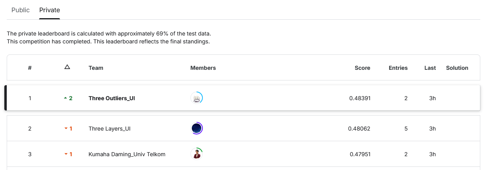

# GEMASTIK XVII (2024): Multimodal Public Report Routing and UKT Group Classification

> Data Mining division of GEMASTIK XVII. In our proposal paper we routed Jakarta citizen reports (photo + text) to the right government agency using early fusion of DINOv2 and multilingual-E5 embeddings. In the on-site final we predicted students' tuition fee group (Golongan UKT) from tabular data. **Result:** 1st place on the final-round private leaderboard (macro F1 0.48391), according to the leaderboard screenshot in our final deck.

This folder holds work from both stages of the competition:

1. **Proposal paper**: *"Penugasan Otomatis Laporan Masyarakat pada Platform Cepat Respon Masyarakat Menggunakan Early Fusion Multimodal Transformer"* (Automatic Assignment of Public Reports on the Cepat Respon Masyarakat Platform Using an Early Fusion Multimodal Transformer). Authors: Ikhlasul Akmal Hanif, Eduardus Tjitrahardja, Rahmat Bryan Naufal and Laksmita Rahadianti (supervisor).
2. **On-site final (24 September 2024)**: *Penggolongan UKT* (UKT group classification), a Kaggle-style competition scored with macro F1.

It also includes the notebooks we used to prepare. Some are multimodal practice on RISTEK Datathon 2022 data, and some are our own past competition solutions and tabular practice.



## Problem

**Proposal: CRM report routing.** Residents of Jakarta send reports to [Cepat Respon Masyarakat (CRM)](https://crm.jakarta.go.id/) with a description and a photo. A kelurahan (village office) officer then forwards each report by hand to the responsible agency, which the paper says takes almost two hours on average. We scraped 53,885 public reports from 2023 (id, photo, description, forwarding time, handling agency). The target is the handling agency: the eight most frequent agencies (together more than 90% of reports) plus an `other` class. The metric is accuracy. The notebook uses a stratified 70/15/15 train/validation/test split.

**Final round: UKT classification.** Each row describes a new student through personal data, family economy, family situation, assets and housing conditions. The target is `Golongan UKT`, the tuition fee group, with 8 classes (0 to 7). The deck flags group 1 as heavily under-represented. The deck gives 30,380 training rows and 7,595 test rows. Several text columns are very messy; for example, one housing-material column has 3,266 unique values. Submissions (`id, Golongan UKT`) were scored with macro F1.

## Approach

### Proposal: multimodal early fusion (`notebooks/crm_report_multimodal_embedding_catboost.ipynb`, `docs/`)
- **Embeddings.** Image embeddings are the `[CLS]` token of Hugging Face models (DINOv2 base/large, ResNet-50, ViT-B/16). Text embeddings come from Cendol mT5, IndoBERT, fastText and multilingual-e5-large-instruct. We also tried FLAVA's joint multimodal embedding. Most embeddings were precomputed into `.pkl` files and loaded by the notebook.
- **Early fusion.** The image and text embedding vectors are passed together as CatBoost `embedding_features`. One experiment passes the raw description as a CatBoost `text_features` column next to the DINOv2 embedding instead.
- **Classifier.** CatBoost `MultiClass` on GPU with `learning_rate=0.01` and class weights `w_l = n / (num_classes * n_l)`.
- **Posterior Gaussian Sampling (PGS).** The paper's best model adds PGS to CatBoost. The DINOv2 + multilingual-E5 run and the PGS runs are **not** in the notebooks we have. Their scores come from the paper and from `docs/early_fusion_experiment_scores.xlsx`. The notebook covers the DINOv2, FLAVA, Cendol, fastText and IndoBERT runs.

### Final round: UKT classification (`notebooks/ukt_classification_gbdt_hill_climbing.ipynb`, `docs/ukt_classification_final_presentation.pptx`)
- **Cleaning** (from the deck). We unified inconsistent spellings (e.g. `S- 3`/`S3`/`S-3` became `S3`; `-`/`Tidak Ada`/`Tidak Dapat` became `Tidak`), filled missing values with heuristic and non-heuristic rules, and removed outliers above the upper IQR bound.
- **N-gram features for messy text columns.** We ran AutoGluon's `AutoMLPipelineFeatureGenerator` over the features, including the free-text columns `Bahan Atap/Tembok/Lantai Rumah` (roof, wall and floor materials). It produces n-gram and text-statistics features. We added a `Provinsi` column that we extracted separately (`data/test_provinsi.csv`). The final run loaded the generated feature tables (`train_gluon_no_clean.csv`, `test_gluon_no_clean.csv`) and filled missing values with `-1`.
- **Models.** 5-fold stratified OOF training of CatBoost, LightGBM and XGBoost, all on GPU. LightGBM uses the cost-sensitive class weights `n / (num_classes * n_l)`.
- **Hill-climbing ensemble.** Starting from the best OOF model, we added the other models one at a time with the weight in [0.01, 0.50] that most improves OOF macro F1. The final blend is CatBoost + 0.35 × LightGBM + 0.01 × XGBoost. It is applied to the averaged test-fold probabilities.

### Preparation (`preparation/`)
- **RISTEK Datathon 2022 (tweets with images, binary label).** These notebooks try multimodal models on a small image + text dataset:
  - AutoGluon `MultiModalPredictor`;
  - a BERT + ResNet fusion network;
  - ViLT, Data2Vec (vision + text) and FLAVA embeddings with CatBoost/LightGBM heads;
  - VisualBERT (detectron2 region features, which crashed) and ViLT features.
- **Our earlier competition solutions**, used as templates:
  - Data Slayer 1.0 2023, CO2 emission regression;
  - Dataquest UNAIR 2023, rainfall prediction at IKN, plus a regression hill-climbing notebook;
  - RISTEK Data Science open recruitment 2022, StarCraft race multiclass. This one comes in two versions: Rahmat Bryan Naufal's original and a revised copy that adds an ordinal-encoded `tournament` feature and Stratified K-Fold CV.
- **Tabular multiclass practice on a "spacecraft" race dataset:**
  - feature importance across 5 models plus SHAP;
  - backward feature selection with CatBoost CV;
  - SMOTE/ADASYN/undersampling versus class weights with XGBoost;
  - SHAP waterfall error analysis.

## Results

**Final round: UKT classification** (5-fold OOF macro F1 from the notebook; leaderboard from the deck)

| Model | OOF macro F1 |
|---|---|
| Decision Tree (baseline, deck) | 0.381 |
| Random Forest (baseline, deck) | 0.416 |
| XGBoost | 0.4579 |
| LightGBM (class-weighted) | 0.4638 |
| CatBoost | 0.4675 |
| Hill-climbing ensemble (CatBoost + LightGBM + XGBoost) | **0.4754** |
| **Private leaderboard (about 69% of test), rank 1 of all teams** | **0.48391** |

The deck reports cost-sensitive learning raising CV from 0.467 to 0.472, and hill climbing taking it from 0.472 to 0.475.

**Proposal: test accuracy on the 15% hold-out split**

| Image model | Text model | Accuracy (paper) | Accuracy (notebook) |
|---|---|---|---|
| DINOv2-large | – | 0.6674* | 0.6386 |
| DINOv2-base | – | – | 0.6196 |
| – | Cendol mT5 | – | 0.6773 |
| – | multilingual-e5-large-instruct | 0.7872 | – |
| FLAVA (joint) | FLAVA (joint) | – | 0.6437 |
| DINOv2-large | raw text via CatBoost `text_features` | – | 0.7664 |
| ResNet-50 | IndoBERT | 0.6674 | 0.6675 |
| ResNet-50 | fastText | 0.6899 | 0.6900 |
| ResNet-50 | Cendol mT5 | 0.7096 | – |
| ResNet-50 | multilingual E5 | 0.7914 | – |
| ViT-B/16 | IndoBERT | 0.6899 | – |
| ViT-B/16 | fastText | 0.7024 | – |
| ViT-B/16 | Cendol mT5 | 0.7229 | – |
| ViT-B/16 | multilingual E5 | 0.7912 | – |
| DINOv2 | IndoBERT | 0.7327 | – |
| DINOv2 | fastText | 0.7476 | – |
| DINOv2 | Cendol mT5 | 0.7498 | 0.7498 |
| **DINOv2** | **multilingual E5** (+ PGS) | **0.8055** | – |

The paper reports CatBoost without PGS at 0.7571 and CatBoost + PGS at 0.8055. \*The paper's ablation table gives 0.6674 for DINOv2 alone. Our score sheet and the notebook give 0.6386 for DINOv2-large, so the paper figure looks like a copy error. The paper's multimodal rows mostly match `docs/early_fusion_experiment_scores.xlsx`, which also lists a non-pooled DINOv2 + E5 variant at 0.7571.

## Repository structure

```
gemastik-xvii/
├── README.md
├── notebooks/
│   ├── crm_report_multimodal_embedding_catboost.ipynb  # proposal: image/text embeddings + CatBoost early fusion experiments
│   └── ukt_classification_gbdt_hill_climbing.ipynb     # final round: AutoGluon features, CatBoost/LGBM/XGB OOF, hill climbing, submission
├── preparation/
│   ├── ristek_datathon_2022_autogluon_multimodal.ipynb           # AutoGluon MultiModalPredictor on image + tweet text
│   ├── ristek_datathon_2022_bert_resnet_fusion.ipynb             # BERT + ResNet fusion network (not run)
│   ├── ristek_datathon_2022_vilt_data2vec_flava_catboost.ipynb   # ViLT / Data2Vec / FLAVA embeddings + CatBoost/LightGBM
│   ├── ristek_datathon_2022_visualbert_vilt_features.ipynb       # VisualBERT region features (crashed) and ViLT (Colab)
│   ├── data_slayer_2023_co2_emission_solution.ipynb              # our Data Slayer 1.0 2023 prelim solution (CO2 emissions)
│   ├── dataquest_2023_rainfall_solution.ipynb                    # our Dataquest UNAIR 2023 prelim solution (rainfall at IKN)
│   ├── dataquest_2023_rainfall_hill_climbing_regression.ipynb    # regression OOF + hill-climbing template on the Dataquest data
│   ├── ristek_oprec_2022_starcraft_solution_original.ipynb       # Rahmat Bryan Naufal's RISTEK DS open-recruitment solution
│   ├── ristek_oprec_2022_starcraft_solution_revised.ipynb        # revised copy used as a multiclass template (adds CV)
│   ├── spacecraft_multiclass_feature_importance.ipynb            # feature importance heatmap across 5 models + SHAP
│   ├── spacecraft_multiclass_feature_selection.ipynb             # backward feature selection with CatBoost CV
│   ├── spacecraft_multiclass_resampling_class_weights.ipynb      # over/under-sampling vs class weights with XGBoost
│   └── spacecraft_multiclass_shap_error_analysis.ipynb           # SHAP waterfall on misclassified rows
├── docs/
│   ├── crm_multimodal_early_fusion_paper.docx          # our proposal paper (original title above)
│   ├── ukt_classification_final_presentation.pptx      # our final-round deck "Penggolongan UKT"
│   └── early_fusion_experiment_scores.xlsx             # our accuracy table for every embedding combination
├── data/
│   ├── crm_test_predictions_dinov2_e5_not_pooled.csv   # CRM test split (8,083 reports) with predictions of the non-pooled DINOv2 + E5 model
│   ├── test_provinsi.csv                               # Provinsi column extracted for the UKT test set
│   └── submissions/
│       ├── ukt_submission.csv                          # final-round submission (id, Golongan UKT)
│       └── ukt_submission_last.csv                     # second final-round submission (header mislabelled "matchup")
├── assets/
│   ├── ukt_final_private_leaderboard.png               # private leaderboard screenshot from our deck
│   └── team_photo.png                                  # team photo (frame from our team video)
└── references/                                         # third-party material, see below
```

### References (third-party material we studied)
| File | Source |
|---|---|
| `references/kaggle_post_ensembling_hill_climbing_weighted_scipy.ipynb` | Kaggle notebook "post-ensembling-hill-climbing-weighted-scipy" (Tabular Playground Series Nov 2022). It is adapted from [shergreen](https://www.kaggle.com/code/shergreen/ensemble-oof-sub-py) and [Laurent Pourchot](https://www.kaggle.com/code/pourchot/stacking-with-scipy-minimize). |
| `references/kaggle_ps_s3e3_hill_climbing_like_a_gm.ipynb` | Kaggle notebook "PS S3E3: Hill Climbing like a GM" (Playground Series S3E3), based on Chris Deotte's [hill-climbing post](https://www.kaggle.com/competitions/feedback-prize-english-language-learning/discussion/369609). |
| `references/kaggle_ps4e2_obesity_hill_climbing_baseline.ipynb` | Kaggle notebook "hillclimbing-ps4e2-multiclass-prediction-of-obesity-baseline" (Playground Series S4E2). |
| `references/dice_counterfactual_explanations_tutorial.ipynb` | Indonesian walkthrough of the [DiCE](https://github.com/interpretml/DiCE) getting-started docs (interpretml). |
| `references/autofeat_examples.ipynb` | Example notebook from the [autofeat](https://github.com/cod3licious/autofeat) library. |
| `references/dataquest_2023_rainfall_xgboost_three_layers.ipynb` | Dataquest UA 2023 rainfall solution. Its output files are named `*_threelayers.csv`, which suggests it came from team Three Layers. Originally `pemuja_xgboost.ipynb`. |
| `references/gemastik_xvi_three_neurons_krl_crowd_counting_paper.pdf` | GEMASTIK XVI paper by team Three Neurons (Bryan Tjandra, Oey Joshua Jodrian, Nyoo Steven Christopher H.): KRL crowd counting. |
| `references/gemastik_xvi_three_wise_monke_final_deck.pdf` | GEMASTIK XVI (2023) Data Mining final deck by team Three Wise Monke (Institut Teknologi Bandung): LightGBM for cyber-attack classification. |
| `references/matplotlib_handout_intermediate.pdf` | [Matplotlib cheatsheets](https://github.com/matplotlib/cheatsheets), intermediate handout. |
| `references/scikit_learn_cheat_sheet.pdf` | Scikit-Learn cheat sheet (DataCamp). |

Not included: the Kaggle notebook "automatic-eda-libraries-comparisson" (51 MB of third-party output). Also left out:
- the report photos and precomputed embedding `.pkl` files (DINOv2, ViT, multilingual-e5, FLAVA; up to about 224 MB each);
- our raw CRM scrape (`dataset.csv`, 5.2 MB);
- the UKT competition data;
- the saved CatBoost model;
- the Turnitin report;
- the team's expense sheet;
- a 7-second team video clip.

## How to run

**Proposal notebook.** The CRM dataset is our own scrape of public reports on [crm.jakarta.go.id](https://crm.jakarta.go.id/) and is not published here, because of its size and the photos. The notebook expects these files in `data/`:

```
data/
├── data_clean.csv                 # cleaned CRM reports (report_id, description, image_path, dinas_clean, ...)
├── photo/photo/<report_id>.jpg    # report photos
├── DINOv2-large-pretrained.pkl    # precomputed embeddings (image_embedding / text_embed columns)
├── Resnet-50.pkl
├── cendol-mt5-large-inst.pkl
├── fast-text.pkl
├── indo-bert.pkl
└── flava_full_embed.pkl
```

It was run on Kaggle with a GPU. Dependencies: `transformers`, `datasets`, `torch`, `catboost`, `scikit-learn`, `pandas`, `seaborn`.

**Final-round notebook.** The competition data was only available during the on-site final and is not public. The notebook reads its inputs relative to its own folder:
- `dataset/train.csv`, `dataset/test.csv`;
- `our_dataset/train_provinsi.csv`;
- the AutoGluon feature tables `train_gluon_no_clean.csv` / `test_gluon_no_clean.csv`.

It writes OOF and test predictions to `output/`. The final run used a Windows laptop with an RTX 3060. Dependencies: `autogluon` 1.1.1, `catboost`, `lightgbm` (GPU build), `xgboost`, `scikit-learn`, `optuna`.

**Preparation notebooks.** They were run on Kaggle or Colab. The Kaggle ones keep their `/kaggle/input/...` paths. The Colab ones read from `../data/<dataset>/` (`ristek_oprec_2022`, `dataquest`, `ristek-datathon-2022`).

## Team
[Three Outliers](../README.md#team): [Eduardus Tjitrahardja](https://www.linkedin.com/in/edutjie/), [Ikhlasul Akmal Hanif](https://www.linkedin.com/in/ikhlasul-akmal-h/), [Rahmat Bryan Naufal](https://www.linkedin.com/in/rahmat-bryan-naufal/)
